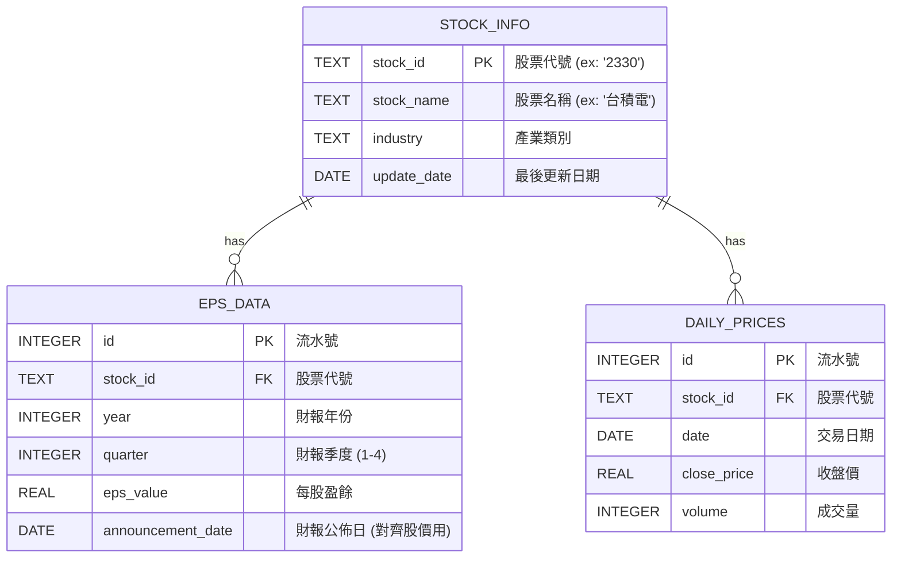

# 股票與 EPS 資料庫設計文件 (Database Schema)

本文件描述了台股歷史股價與每股盈餘 (EPS) 分析系統的本地 SQLite 資料庫設計。

## 實體關聯圖 (ERD)

## 資料表字典 (Data Dictionary)

### 1. `stock_info` (股票基本資料表)
記錄所有追蹤的股票清單。

| 欄位名稱 | 型態 | 屬性 | 說明 |
| :--- | :--- | :--- | :--- |
| `stock_id` | TEXT | Primary Key | 股票代號，例如 '2330' |
| `stock_name` | TEXT | | 股票名稱，例如 '台積電' |
| `industry` | TEXT | | 產業類別 (可選，用於產業分析) |
| `update_date`| DATE | | 基本資料最後更新的時間 |

### 2. `eps_data` (每股盈餘資料表)
記錄每季公佈的 EPS 資料。**注意：比對股價時，應依據 `announcement_date` 而非財報所屬季度，避免未來函數。**

| 欄位名稱 | 型態 | 屬性 | 說明 |
| :--- | :--- | :--- | :--- |
| `id` | INTEGER | Primary Key, Auto Increment | 流水號 |
| `stock_id` | TEXT | Foreign Key | 關聯至 `stock_info.stock_id` |
| `year` | INTEGER | | 財報所屬年份 (ex: 2023) |
| `quarter` | INTEGER | | 財報所屬季度 (1~4) |
| `eps_value`| REAL | | 當季 EPS 數值 |
| `announcement_date`| DATE | | 實際公佈財報的日期 |

*Unique Constraint*: `(stock_id, year, quarter)` 避免重複新增同一季資料。

### 3. `daily_prices` (歷史股價表)
記錄每日收盤價與成交量，用於與 EPS 走勢進行比對。

| 欄位名稱 | 型態 | 屬性 | 說明 |
| :--- | :--- | :--- | :--- |
| `id` | INTEGER | Primary Key, Auto Increment | 流水號 |
| `stock_id` | TEXT | Foreign Key | 關聯至 `stock_info.stock_id` |
| `date` | DATE | | 交易日期 (YYYY-MM-DD) |
| `close_price` | REAL | | 當日收盤價 |
| `volume` | INTEGER | | 當日成交量 |

*Unique Constraint*: `(stock_id, date)` 避免重複新增同一天的股價。
